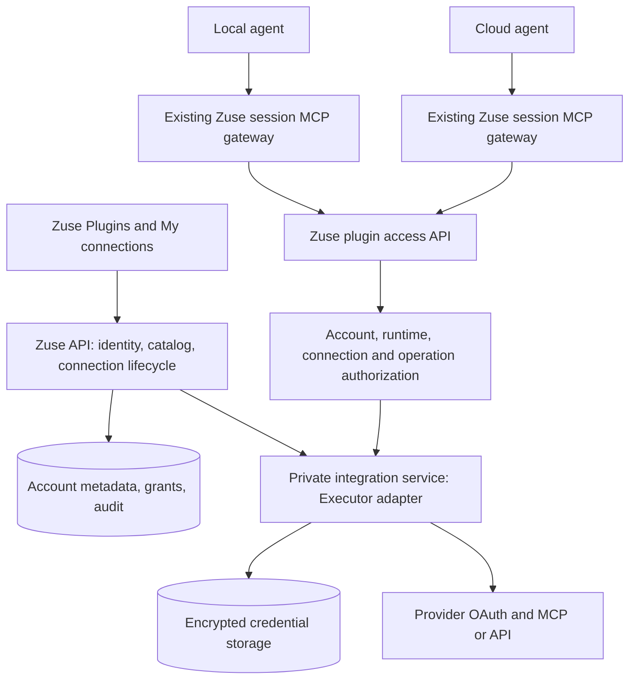

# Zuse managed plugins: research and implementation plan

Status: proposed, research complete; implementation and live OAuth validation not started.
Date: 2026-10-01.

## Recommendation

Build a Zuse-owned plugin catalog and account-level connection service. Evaluate the
Executor gateway SDK as its internal integration engine, behind a small adapter.
Prioritize existing remote MCP servers and their automatic client-registration
flows. Do not require Zuse to register a custom OAuth app with every service, and
do not introduce a managed connector vendor such as Composio. Users see Zuse and the service they are connecting, never an Executor dashboard,
account, server URL, or configuration file. Connect once, then use the connection
from authorized Zuse agents on the desktop or in cloud workspaces.

Executor is a credible implementation candidate, not an already verified turnkey
white-label service. Its gateway SDK and v2 beta documentation describe different
models. Pin the gateway source/package versions and prove the required behavior
before building the catalog around it. The detailed, source-linked evaluation is
in [Executor research](../research/executor-plugin-platform-research.md).

The architecture should survive replacing Executor. Zuse owns user identity,
catalog identifiers, connection ownership, policy, grants, presentation, and audit.
The engine owns upstream protocol handling and credential refresh behind that
boundary. Do not build a general marketplace, arbitrary code runner, or plugin
installer as a prerequisite for this experience.

## Product contract

1. A signed-in user opens **Plugins**, searches a maintained catalog, and clicks
   **Connect**. No server URL, terminal command, or Executor account is requested.
2. For protected servers, the system browser opens the MCP server's authorization
   flow. Use automatic client registration or client metadata where supported,
   with Zuse client identity and callbacks. Public servers need no OAuth flow.
   A Zuse callback page confirms successful authorization when needed.
3. **My connections** shows the actual provider account/workspace, granted access,
   status, and reconnect/disconnect controls. Multiple accounts of the same plugin
   are distinct connections with explicit labels.
4. Connections belong to the Zuse account and are available on its authorized
   local and cloud runtimes. Availability and permission to execute are separate:
   conversation/project selection and the existing permission mode still apply.
5. Connecting must work even if the currently selected cloud workspace is asleep.
   The account catalog does not depend on a runtime being online.
6. Plugin outages do not prevent ordinary chat or built-in tools from working.

The zero-configuration promise applies to curated hosted integrations whose
endpoint and auth setup Zuse can supply. Arbitrary localhost MCPs, private network
services, API-key-only services, and customer-specific domains cannot universally
offer redirect-only onboarding. Keep existing native MCP support as an advanced
surface; qualify each catalog entry rather than advertise every MCP as one-click.
Local agents using hosted plugins still require an internet connection.

Initial scope is managed tool connections. Skills, downloadable binaries, hooks,
untrusted third-party plugin code, public submissions, and revenue sharing are
separate ecosystem features. They should not share the same implicit trust model.

## Existing architecture and reuse

Paths below are relative to the repository root and describe the inspected code,
not promised capabilities of every driver.

| Existing component | Evidence | Planned use |
| --- | --- | --- |
| Native MCP inventory | `packages/contracts/src/mcp.ts`, `apps/server/src/mcp/layers/mcp-service.ts`, `apps/server/src/mcp/native-config.ts` | Preserve provider-owned/native definitions; add managed connection references and availability rather than rewriting native files. |
| Runtime-scoped UI cache | `apps/renderer/src/store/mcp.ts` | Keep native inventory environment-scoped; introduce account-scoped connection state and merge only at display/session resolution boundaries. |
| MCP settings and composer | `apps/renderer/src/components/settings/mcp-servers-pane.tsx`, `apps/renderer/src/components/mcp-popover.tsx` | Plugins is the discovery surface; composer shows enabled connections and their effective runtime status. |
| Shared session MCP gateway | `packages/agents/src/mcp-gateway/index.ts`, `packages/agents/src/kernel/provider-mcp-session.ts` | Add injected managed-tool dependencies to the shared gateway. Preserve its live-handle token lifetime and disposal behavior. |
| Gateway consumers | `packages/agents/src/drivers/{claude,codex,grok,gemini,kiro}.ts` | Existing common seam, with driver-specific compatibility tests. |
| Cursor MCP support | `packages/agents/src/drivers/cursor.ts`, `apps/server/src/provider/layers/provider-service.ts` | Feed the same Zuse gateway through its existing MCP normalization/configuration seam. |
| Other drivers | `packages/agents/src/drivers/{opencode,opencode2,pi}.ts` | No use of the shared gateway found in this inspection; explicit adapter work and live verification required. |
| Account and runtime authentication | `infra/api/src/auth.ts`, `infra/api/src/workos.ts`, `infra/api/src/cloud-workspace-runtime-fence.ts` | Derive identity from authenticated principals; reuse runtime ownership/revocation fences. |
| Hosted persistence and secret encryption | `infra/api/drizzle/schema.ts`, `infra/api/src/api-sealing.ts`, `infra/api/src/slack/persistence.ts` | Reuse hosted SQL and encryption conventions, without coupling plugin connections to Slack installation records. |
| Existing Linear integration | `apps/server/src/linear/layers/linear-service.ts`, `apps/renderer/src/components/settings/linear-integrations-pane.tsx` | Preserve ticket workflows; eventually route managed Linear credentials through one shared connection source. |
| GitHub installation grants | `infra/api/src/cloud-github-app.ts` | Evaluate reuse for approved tools; do not silently broaden repository installation permissions or change the Git credential broker. |

There is a documentation tension to resolve during implementation: the current MCP
contract explicitly says Zuse stores no server registry, while historical
[ADR 0032](../../specs/self-orchestration/decisions/0032-mcp-connector-passthrough.md)
proposed a registry. Add a new decision describing an account-owned managed
catalog alongside native passthrough; do not silently rewrite historical decisions.

[ADR 0001](../adr/0001-e2b-cloud-workspace-auth.md) keeps local and cloud model-provider
authentication separate. Sharing explicitly connected SaaS plugins does not imply
syncing Claude/Codex credentials, Mac Keychain contents, or provider auth files.
Use the current API terminology and origins from
[ADR 0003](../adr/0003-api-control-plane-naming.md).

## Vendor choice

Updated constraint: the user wants an Executor-style MCP service, without a managed
connector vendor or manually creating OAuth apps for the whole catalog. The vendor
comparisons below are retained as research only, not fallback recommendations.

| Approach | Fit | Limitation | Decision |
| --- | --- | --- | --- |
| Embed Executor gateway SDK in a Zuse-operated service | Custom catalog, upstream MCP/API support, user-owned connections, control of branding and hosting | Pre-1.0 APIs; host identity, storage, refresh concurrency, branding and ops need validation | Preferred technical spike. |
| Use stock Executor hosted/self-host UI | Quick personal/team gateway | Not the requested embedded UX; do not infer end-user tenancy from a shared organization | Do not expose to Zuse users. |
| Composio | Documented per-user accounts and custom OAuth apps | Outside the requested approach | Excluded by user direction. |
| Pipedream Connect | Per-user MCP, account selection, custom OAuth clients | Outside the requested approach | Research comparison only. |
| Build each connector directly | Full control and small initial dependency surface | Zuse maintains every provider's API/auth differences | Use for existing integrations and exceptional connectors, not the default for a large catalog. |

Composio documents user-keyed connections and OAuth lifecycle management. Its
white-label guide supports custom OAuth apps, but the documented domain workaround
still redirects the browser to Composio. Do not equate branded consent with a
vendor-invisible redirect chain.
[Authentication](https://docs.composio.dev/docs/authentication),
[white-label guide](https://docs.composio.dev/docs/authentication/white-labeling-authentication).

Pipedream's MCP API accepts an external user ID and optional account ID with
developer authentication. Those headers must be set by trusted Zuse backend code,
never accepted as authority from an agent. Its customization guide explicitly
retains vendor text; custom OAuth clients alone do not establish full white-labeling.
[MCP API](https://pipedream.com/docs/connect/mcp/developers),
[customization](https://pipedream.com/docs/connect/managed-auth/customization),
[OAuth clients](https://pipedream.com/docs/connect/managed-auth/oauth-clients).

These are architectural comparisons, not procurement conclusions. Obtain actual
hosting, support, usage, and branding terms before committing to a paid platform.

### Default: connect to the service's existing remote MCP

MCP transport and authorization are separate. Public MCP servers can connect
without OAuth; protected ones can use a generic OAuth client flow without manual
developer-app registration. The protocol includes client metadata documents and
dynamic client registration (DCR), subject to server support and trust policy.
[MCP authorization](https://modelcontextprotocol.io/specification/2025-11-25/basic/authorization).

Executor's pinned source discovers protected-resource and authorization-server
metadata, registers at the advertised registration endpoint, and builds a PKCE
authorization flow. Its DCR helper accepts client metadata overrides, including
client name, URI and redirect URIs. Configure these as Zuse. Its hosted client
metadata document has hardcoded branding that needs a Zuse-owned replacement;
verify actual metadata-document negotiation separately from DCR.
[Executor discovery source](https://github.com/UsefulSoftwareCo/executor/blob/98d606bd2b47b9dcc2c03a129a14b5134d9852c8/packages/core/sdk/src/oauth-discovery.ts),
[metadata route](https://github.com/UsefulSoftwareCo/executor/blob/98d606bd2b47b9dcc2c03a129a14b5134d9852c8/packages/core/api/src/server/oauth-client-metadata.ts).

Linear is a concrete initial target: its official remote MCP explicitly supports
OAuth with dynamic client registration. This establishes a documented route without
manual OAuth-app creation, not a completed live test of Zuse's callback host.
[Linear MCP](https://linear.app/docs/mcp).

Catalog qualification records `none`, automatic MCP OAuth, API token, or required
preregistration. Prioritize public and automatic-OAuth remote MCPs. Keep services
requiring manual apps outside the initial one-click catalog unless separately
justified. Branding describes Zuse's client identity; provider-controlled consent
rendering and trust decisions must still be verified per server. Adding a server
definition never grants access to a user's private account on its own.

## Target architecture

Use `infra/api` for account-facing composition, routes, persistence and runtime
grant validation. Start with a private integration service if the pinned SDK needs
Node/Bun or durable process state; do not assume an arbitrary SDK imports cleanly
into the Cloudflare Worker. Executor's Cloudflare hosting is evidence that such a
deployment can exist, not proof that Zuse's Worker can absorb it without work.
The spike selects Worker-compatible composition versus a separate service based
on storage, OAuth callbacks, connection pooling, and long-running call behavior.

The integration adapter has a narrow conceptual interface: begin/complete auth,
get connection status, revoke/delete connection, discover/describe tools, invoke
one tool, cancel a call. These names are proposed Zuse interfaces, not claims about
Executor's exact exported methods. Pin and map the real SDK at implementation time.

The inspected SDK exposes `executor.tools.list`, `executor.tools.schema`, and
`executor.execute(address, args, options)`. Its README's `tools.invoke` examples
are stale relative to the pinned interface; implementation must follow the source.
See the [pinned API evidence](../research/executor-plugin-platform-research.md#implementation-shaping-findings-from-final-source-review).

Prefer direct typed tool invocation for the first release. Do not expose stock
Executor management tools, arbitrary execution, secret inspection, or artifact UI
through the Zuse gateway. An engine policy/elicitation request must resolve through
Zuse's permission broker; never use an `accept-all` example as the production policy.
The stock MCP passthrough also auto-accepts policy elicitation based on assumed
client approval. Use the direct SDK seam and a trusted Zuse handler instead.
Bind an approval to owner, runtime/session, connection, exact operation, argument
digest, expiry and policy revision. Persist pending approval state and resume it
only through authenticated user decisions, not a model-supplied “approved” field.
After restart, recover safely or report an interrupted call; never replay a mutation
just to reconstruct an in-memory waiting callback.

### Ownership and data model

| Record | Proposed fields and invariant |
| --- | --- |
| Plugin definition | Stable Zuse `pluginId`, display metadata, integration type, vetted endpoint/template, auth mode and discovery configuration, optional preregistered client reference, permission descriptions, tool policy/version, support status. Controlled by Zuse, no credentials. |
| Connection | Opaque `connectionId`, owner `accountId`, `pluginId`, provider account/workspace identity, label, granted scopes, state, engine reference, revision, timestamps. Multiple connections per plugin allowed. |
| Connect attempt | Owner, plugin, intended reconnect target, hashed state/nonce, PKCE reference when applicable, browser binding, expiry, validated return target, consumed marker. |
| Connection access selection | Owner, optional project/conversation binding, explicitly selected connection IDs, allowed actions/permission policy, revision. Selection cannot exceed the owner's grants. |
| Runtime grant | Account, enrolled environment, workspace/session where applicable, runtime incarnation, audience, expiration, policy revision, permitted connection set. Revocable; no provider token. |
| Invocation receipt | Account, connection, runtime/session, operation, policy decision, request/idempotency identifier, outcome, duration, trace ID. Redact inputs/results by default. |

For the first release a Zuse account is a personal principal. Derive any Executor
tenant/subject mapping entirely server-side and persist it; never use email as the
identifier or let a request choose another tenant. A per-account tenant boundary
with a stable user subject is a candidate mapping. Validate how shared catalog
definitions coexist with that mapping in the SDK spike. Organization sharing is a
later explicit permission feature, not an automatic consequence of connecting a
workspace. Provider organizations and Zuse accounts are different identities.

There must be one owner of rotating credentials. Store provider tokens in the
engine's encrypted credential store, and retain only opaque references and
sanitized metadata in Zuse account records. If the adapter uses Zuse storage,
implement one authoritative store beneath the engine, not a second token copy.
Encrypted secrets need backup/restore and encryption-key rotation with key IDs;
neither runtime images nor renderer state may contain them.

### Connect flow

1. Authenticated UI requests a connect attempt for an allowlisted plugin ID.
   API derives the owner and stores an expiring, single-use attempt. It selects
   the fixed MCP endpoint server-side and discovers its auth requirements. For
   automatic OAuth, supply Zuse client metadata and obtain/reuse client registration;
   do not ask the user for a client ID or secret. Public MCPs skip the OAuth steps
   but still receive an account-owned enabled connection record.
2. UI opens the returned short-lived authorization URL in the system browser.
   Reuse desktop external-browser handling. No upstream secrets cross the UI.
3. Provider redirects to a registered Zuse HTTPS callback. Validate state, flow
   binding, expiry, provider/issuer as applicable, and PKCE where supported.
   Bind the returning browser to the initiating Zuse identity before activation
   (or use a verified continuation flow); possession of a forwarded auth URL alone
   must not attach a victim's provider account to another Zuse account.
4. The credential authority exchanges the code, stores credentials, and checks
   actual provider identity and granted scopes. A redirect alone is not success.
5. Commit connection activation idempotently; publish a revision/status change.
   The Zuse success page can return to the app via an opaque continuation, with
   polling as a fallback when deep links or the original window are unavailable.
6. A cancelled/expired/failed attempt preserves prior working connections.
   Reconnect validates the intended provider identity; switching accounts is an
   explicit new connection, not a silent replacement.

Engine persistence and Zuse metadata may not share a transaction. Use the connect
attempt ID as a reconciliation/idempotency key, retain an intermediate state, and
repair an engine connection created before an API commit failed. The reconciler
must clean up abandoned engine credentials and must not activate an attempt that
was cancelled or whose account was deleted while OAuth was in flight.

The callback URI used for token exchange and the UI return URI are different
concepts. Do not implement white-labeling by blindly forwarding callback query
strings or arbitrary return URLs. Advertise and test the exact provider-supported
callback flow. MCP upstream OAuth also needs resource/audience validation and
must not forward a Zuse token to an upstream resource.
[MCP authorization specification](https://modelcontextprotocol.io/specification/2025-11-25/basic/authorization).

### Agent access across local and cloud

An enrolled runtime obtains a short-lived plugin grant after Zuse verifies its
account ownership and current runtime incarnation. The runtime's existing gateway
holds and refreshes that grant internally. Agent processes continue using the
existing gateway's local session token, which lasts for the live provider handle;
do not introduce an expiry that strands clients unable to refresh their MCP headers.

At each invocation, the API checks the current connection state, selected connection
set, account/runtime status, operation policy and grant binding. A signed grant
alone is insufficient after disconnection. Refresh is single-flight; cloud resume
and provider-handle replacement reacquire grants rather than resurrecting saved
ones. Signing out/account switching clears account caches and runtime capabilities.
Device removal/account deletion invalidate access centrally.

Use one shared tool adapter through the existing session gateway. Give tools stable
Zuse names and include connection labels in descriptions and permission prompts.
Never silently choose the first connection when personal and work accounts coexist.
For large catalogs, expose discovery plus exact schema lookup and typed invocation
without dumping every tool into every prompt. A generic invocation wrapper must
authorize the resolved operation and connection, not just approve the wrapper name.
Use that same policy check even if a provider omits its native approval callback.

The first supported surface can be tools-only, with JSON/text/image results under
explicit size limits. Plugins requiring resources, prompts, sampling, URL elicitation,
or interactive MCP apps must either have those capabilities implemented and tested
or be excluded/labeled unsupported. A tool wrapper is not transparent support for
the entire MCP protocol. No claim of compatibility with every upstream MCP.

## UI and behavior

Plugins has searchable **Browse** and **My connections** views. Rows show service
icon/name, a brief capability description, and Connect or connection count. Details
show requested access before leaving the app. Use compact spacing and subtle tonal
backgrounds; visible inputs and actions use `h-7`, with accessible labels, keyboard
navigation, focus restoration, and translated strings.

Connection rows show the provider identity (for example, Slack workspace), an
editable label, last verified status and actions. Separate credential health from
runtime availability: “Connected” does not mean an older agent has loaded it.
Composer selection shows “Available next turn” or “New session required” when a
driver cannot refresh safely; never silently restart a live task.

| Situation | User-visible behavior |
| --- | --- |
| Not signed into Zuse | Explain that managed connections require a Zuse account; existing native MCP setup still works. |
| Awaiting authorization | Connecting indicator; reopen browser/cancel; completion recovered after app restart. |
| Provider denied consent | No connection created; actionable retry. |
| Expired/revoked upstream auth | Reconnect the affected connection; other connections stay usable. |
| Provider temporarily unavailable | Retain connection and label; retry status, do not call it disconnected. |
| Missing provider scopes/admin consent | Explain required access and reconnect/admin action; do not repeatedly loop OAuth. |
| Multiple provider accounts | Explicit account selection, visible in tool approvals. |
| Disconnect | Stop new calls immediately after revocation commits; explain already-dispatched calls may finish. |
| Desktop offline | Cached list labeled offline; no false connected/usable state. |

Keep vendor identifiers out of frontend DTOs, normal errors, OAuth metadata, tool
descriptions and callback pages. Source licenses/notices and necessary operational
disclosures are separate from product branding. Test the complete browser journey,
including consent and error pages; changing a logo is insufficient.

## Reliability, security and performance

| Failure/attack | Required handling |
| --- | --- |
| Tenant or connection ID substitution | Owner-scoped lookup on list, auth completion, discovery, invoke, reconnect, revoke and artifacts; negative tests with two accounts. |
| Concurrent OAuth callbacks | Single-use attempt plus transactional/idempotent activation; late callback cannot revive a disconnected connection. |
| Multiple workers refreshing one token | Credential-authority lock/CAS per connection; do not rely only on process-local locking. |
| Disconnect racing refresh/call | Increment revocation revision before cleanup; refresh cannot re-enable; reject new admissions, best-effort cancel in-flight calls. |
| Unknown outcome after mutation timeout | Record unknown outcome; no automatic repeat of send/create/delete unless provider supports a safe idempotency key. |
| Suspended runtime, old image or stale grant | Check runtime fence and current policy; reissue on resume; do not modify existing runtime data paths. |
| Provider rate limit/outage | Honor Retry-After, bounded backoff for safe calls, concurrency limits per account/provider, circuit isolation. |
| Malicious upstream metadata or tool output | Treat as untrusted content, constrain schema/result sizes, never grant policy from tool descriptions or model assertions. |
| Endpoint/redirect SSRF | Zuse-controlled endpoints, block private/metadata destinations and unsafe redirect hops, enforce egress/DNS policy at execution. |
| Lost credential store | Tested encrypted backups and restore; otherwise one account-level reconnect, never per-chat credential copying. |
| Account deletion during vendor outage | Local access revoked first; durable retryable credential/vendor cleanup tracked until complete. |
| Partial rollout or engine outage | Feature/version gates and per-plugin kill switch; built-in/native tools and chat startup remain independent. |

Cache static plugin definitions by catalog version, and tool schemas by plugin
version plus visibility/scope where discovery is account-dependent. Private discovery
results are never globally cached. Connection metadata caches are keyed by owner and
revision; authorization is rechecked on execution. Bound connection pools and
in-flight operations, propagate cancellation/deadlines and clean up MCP transports.

Proposed targets to measure, not existing benchmarks: cached plugin browsing p95
under 200 ms; Zuse-added invocation overhead p95 under 150 ms in-region excluding
provider/engine work; no upstream plugin discovery on chat's critical startup path.
Measure cold versus warm access from desktop and every cloud region before setting
an SLA. Load-test many idle connections and concurrent sessions, not only one demo.

## Implementation sequence and acceptance gates

### 0. Executor feasibility spike

Pin the source commit and installable package versions; validate their APIs match.
Build a disposable Zuse-branded host with durable storage and two synthetic users.
Use one public MCP and one remote MCP with automatic OAuth registration, initially
Linear subject to live qualification. Verify no manual OAuth-app registration is
needed, Zuse client metadata is honored, and the exact redirect chain,
identity separation, two accounts for one service, expiry/refresh, disconnect,
restart, concurrent worker refresh, and typed invocation with denied permission.
Inspect model-visible metadata as well as browser text for vendor leakage.

Gate: the same connection works from one desktop runtime and one cloud runtime,
neither receives upstream credentials, and a cross-user call fails. Record results
and unresolved SDK patches. Failures select a different adapter or explicitly
fund missing platform work before building catalog UI. No credentials were
available or used to perform these live tests during this research task.

### 1. Account connection service

Add contracts, catalog manifests, owned metadata, connect attempts, credential
adapter and lifecycle routes. Proposed routes: `GET /v1/plugins`,
`GET /v1/plugin-connections`, `POST /v1/plugin-connect-attempts`,
`GET /v1/plugin-connect-attempts/:id`,
`GET /v1/plugin-oauth/:pluginId/callback`,
`POST /v1/plugin-connections/:id/reconnect`,
`DELETE /v1/plugin-connections/:id`.
All are proposed APIs, not existing Zuse or Executor endpoints.

Keep adapter implementation in a focused shared package only when reused across
hosts (candidate `packages/integrations`); keep API composition/storage wiring in
`infra/api`, schemas in `packages/contracts`, runtime wiring in `apps/server` and
provider adaptation in `packages/agents`. Do not put behavior into contracts.

Gate: full lifecycle, tenant isolation, callback replay, cleanup and persistence
tests pass, with a real encrypted-store restore test.

### 2. Runtime access and complete agent support

Add scoped grant mint/refresh and private discovery/invocation routes; extend the
shared gateway with injected integration dependencies. Start with Claude and Codex
as vertical slices, then cover every supported driver. User intent is all agents:
the first two are an engineering milestone, not the completed feature.

| Provider | Required implementation/verification |
| --- | --- |
| Claude, Codex | Reuse gateway; verify listing, call, permission prompt, reconnect, cancellation and handle disposal. |
| Grok, Gemini, Kiro | Reuse gateway and existing HTTP/stdio fallback patterns; validate actual transport/auth behavior. |
| Cursor | Inject gateway through its SDK MCP configuration; verify updates and credential-header handling. |
| OpenCode, OpenCode2 | Implement session MCP configuration and cleanup through the shared abstraction; test each driver independently. |
| Pi | Establish supported tool-extension/MCP bridge in the pinned runtime; implement adapter, or surface explicit unsupported status until complete. |

Gate: connect once and call from each supported provider locally and in its supported
cloud execution modes. Cross-check restart/resume, revocation and all permission
modes; registration of a provider ID alone is not evidence of working plugins.

### 3. Branded catalog and lifecycle UI

Add Browse/My connections, authentication return flow, explicit multi-account
selection and composer integration. Reuse UI primitives and account auth; prevent
stale data flashes on account/environment changes. Start with a small qualified
catalog chosen by automatic-auth compatibility (Linear first; qualify Notion and
Sentry next). Evaluate GitHub and Slack separately rather than assume their auth
requirements match. Record the exact
implementation, scopes, account type and support matrix for each. These names are
priorities, not a verified claim that all offer identical OAuth/MCP behavior.

Gate: end-to-end Connect → consent → labeled connection → local call → cloud call
→ reconnect/disconnect is successful with no Executor UI and no URL entry.
Services requiring manual app registration are not a launch dependency. Extend
coverage as compatible remote MCPs become available; do not silently replace them
with a managed API connector platform.

### 4. Existing integrations, rollout and operations

Offer an explicit move/reconnect path for existing local Linear users. Route ticket
features and tools through the shared managed connection once migrated, and avoid
duplicate connection rows/tools. Do not upload existing Keychain credentials without
an explicit migration action. Distinguish a Slack bot installation used to talk to
Zuse from a user's Slack data-access connection. Reuse GitHub installation grants
only where identity/scopes match the requested plugin behavior.

Ship behind account and plugin flags: internal users, opt-in beta, then general
availability after the full driver matrix passes. Retain existing native MCP paths.
Rollback disables new managed calls/connection creation while retaining encrypted
records and audit; do not drop tables or erase credentials. Version runtime/API
capabilities so older workspaces show a useful upgrade status.

Track connection success and time, reauth rate, grant failure, tool latency/error
attribution, permission denial, cleanup failures, vendor cost and active-user cost.
Logs contain opaque IDs and classified errors, not OAuth codes/tokens or tool data.
Estimate monthly cost as service baseline + active connections/users + calls/CPU +
storage/egress/support, with actual vendor quotes. Add metering and account quotas;
do not assume sandbox compute billing covers managed plugin usage. This plan adds
no sandbox provider and requires no runtime database relocation.

## Test and validation plan

| Area | Required tests |
| --- | --- |
| API/store | Two-user isolation for every route, replay/expiry, duplicate callbacks, wrong browser identity, multiple accounts, permission/scope changes, SQL migration, deletion and outbox retries. |
| Credential engine | Concurrent refresh across processes, refresh rotation, revoked/expired tokens, engine restart, encrypted backup restore and key rotation, upstream cleanup failure. |
| Gateway/policy | Exact-operation enforcement even through discovery/invoke wrappers, immutable account binding, redaction, denied calls, grant refresh, expired/stale incarnation, cancellation, bounded large/invalid results. |
| Driver matrix | Listed providers in local/cloud supported modes, fresh session, idle period, restart, refresh/new-session behavior, HTTP/stdio fallback and cleanup. |
| Frontend/browser | Connect success/deny/cancel/timeout, external-browser return, closed/reopened app, account switch, offline cache, duplicate click, multiple identities, keyboard/focus/i18n, `h-7` controls. |
| Failure/load | Provider 429/5xx, disconnected streaming call, unknown mutation outcome without duplicate effects, API/engine outage without blocking chat, bounded memory/pools at concurrency. |
| Branding | Catalog, browser consent/callback/error pages, URLs under Zuse control, frontend DTOs, tool names/descriptions, elicitation and model-visible errors. |

Extend existing `packages/agents/test/integration/mcp-gateway.test.ts` and
`mcp-provider-cleanup.test.ts`, server MCP inventory tests and renderer MCP tests;
add behavior-focused account/plugin suites where the new authority lives.
Implementation checks: Biome on changed supported files, root `bun run check-types`,
targeted package unit/integration suites and live driver/browser scenarios above.
Never describe stubbed SDK tests as a completed real OAuth or cross-runtime test.

Research validation: repository paths and source assumptions inspected; external
claims cite primary sources. Only Markdown documents change in this task; there
is no executable change requiring TypeScript or behavior tests. Biome applicability
was checked with `bunx @biomejs/biome@2.5.3 check --no-errors-on-unmatched` on both
documents: it exited successfully but checked zero files because Markdown is not
supported. This is not a claim of a linted implementation. TypeScript and runtime
tests are not applicable to these documentation-only changes.

## Decisions and remaining evidence

Decisions proposed: account-owned connections; Zuse-owned catalog/auth UX; one
credential authority; existing runtime MCP gateway; typed tools before arbitrary
code execution; full driver compatibility before claiming all-agent support.

The next concrete step is the feasibility spike, not a broad frontend build.
It must settle SDK/package stability, durable tenancy and refresh locking, Zuse
client metadata and callback compatibility, automatic registration coverage,
deployment shape, and realistic
operations cost. No production deployment or paid vendor contract is implied by
this research plan.
